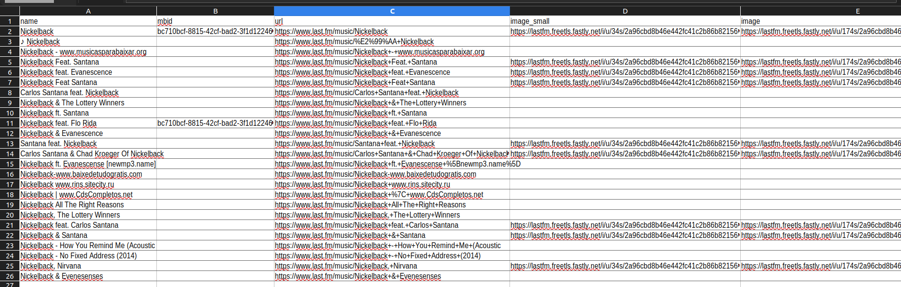
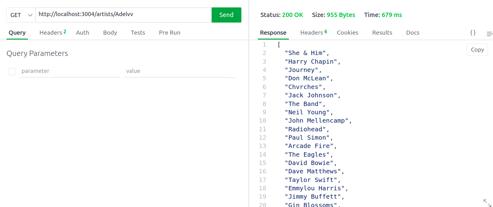

# Last.fm Artist Search API

This Node.js application allows you to search for artists using the Last.fm API and returns a CSV file with the search results, with a fallback to a random artist from a JSON file if no match is found.

## Prerequisites

Before running this application, you must have the following:

- Node.js 
- A Last.fm API key. You can get one by signing up for a Last.fm account and registering for an API key.

## Getting Started  

To get started with this application, follow these steps:

1. Clone this repository to your local machine:
```bash
 git clone https://github.com/meriambs/CodingChallengeIncedo.git 
```

2. Install dependencies by running `npm install`.
```bash
 cd CodingChallengeIncedo
 npm install
```
3. Create a `.env` file in the root of the project directory and add your Last.fm API key as `LASTFM_API_KEY=your-api-key`.
```bash
  /CodingChallengeIncedo/ touch .env
  LASTFM_API_KEY=api-lastfm-api-key-from-last.fm

```

4. Run the application by running `npm start`.
```bash
  /CodingChallengeIncedo/npm start
```
5. Open your web browser and go to `http://localhost:3004/artists/<artist-name>` where `<artist-name>` is the name of the artist you want to search for. The application will return a CSV file with the search results.



## API Routes

### /artists/:name

This route allows the user to search for an artist by name. The `:name` parameter should be replaced with the name of the artist you want to search for. 
-If a matching artist is found, the server returns a CSV file containing the details of the matching artists. 

-If no matching artist is found, a list of random artist names from the `data.json` file is returned.



## Dependencies

This application uses the following dependencies:

- ``express``: A Node.js web application framework
- ``axios``: A promise-based HTTP client for Node.js
- ``csv-writer`: A Node.js module for writing CSV files
- ``dotenv``: A module for loading environment variables from a `.env` file
- ``fs``: A Node.js module for working with the file system
